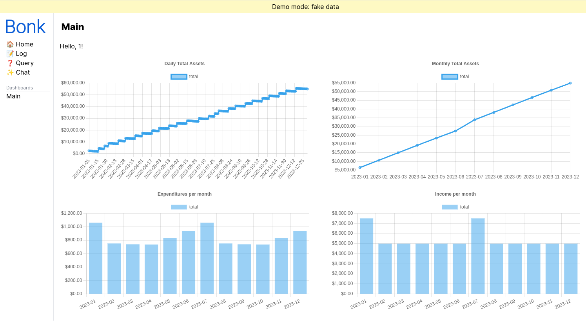
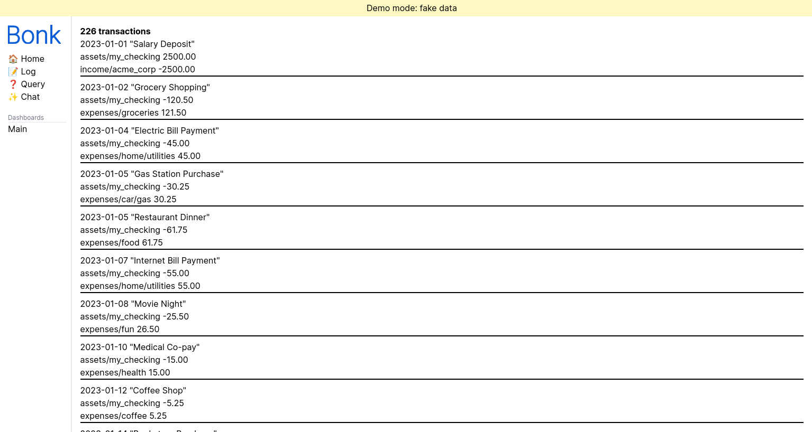
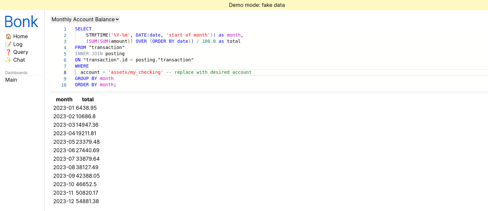
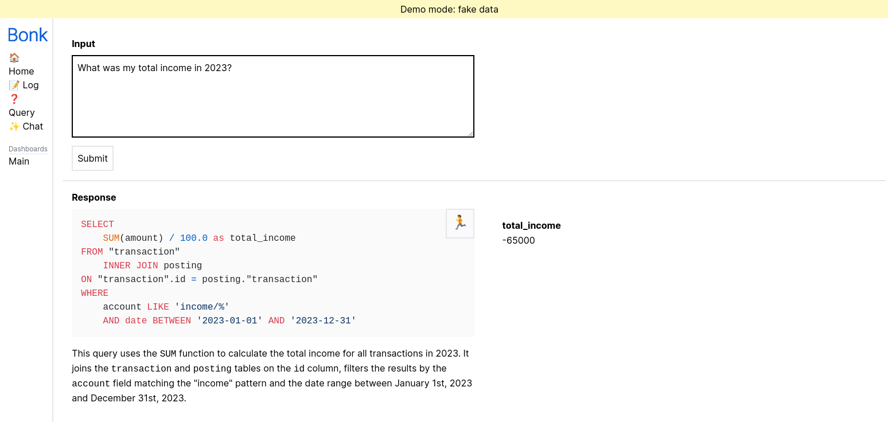

# Bonk

Bonk is a personal accounting tool for understanding the state of your finances. At its core, it is a declarative language for recording financial transactions based on the idea of double-entry bookkeeping. Using this data, you can define queries and dashboards/visualizations to help you answer questions about your finances.

Bonk has many features such as...
* A web-based frontend for visualizing data
* The ability to import transactions via Plaid
* An LLM-powered query generator
* A snapshot-testing tool for your transaction data
* A static checker to catch some mistakes in your transaction data
* An LSP implementation and VS Code extension for the Bonk language

For example, a ledger may contain transactions like...

```bonk
2023-01-01 "Salary Deposit"
  assets/my_checking 1000.0
  income/acme_corp

2023-01-02 "Lunch"
  liabilities/my_credit_card -15.0
  expenses/food

2023-01-03 "Paying my credit card"
  assets/my_checking         -15.0
  liabilities/my_credit_card
```

The [example ledger](./example) contains a full example that ultimately looks like this:

| | |
| - | - |
|  |  |
|  |  |

## Similar Projects
Bonk is heavily inspired by [ledger](https://ledger-cli.org/), [hledger](https://hledger.org/), and especially [beancount](https://beancount.github.io/) and its [fava](https://beancount.github.io/fava/) frontend.

## Disclaimer
Bonk is no where near done, and may never be. I created it for my own personal use and open sourced it in case someone might learn from it. You probably shouldn't use it! (...but if you do, let me know!)
